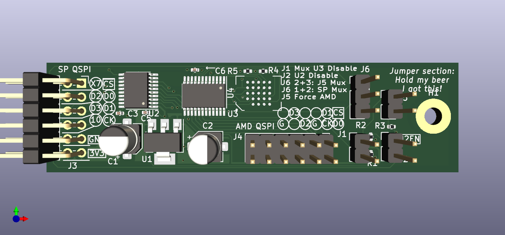

# hw-spimux
PMOD Quad SPI flash mux debug board
Breaks out the Gimletlet QSPI port to a MT25QU256ABA8E12 Flash memory IC.

# Model Change Notices
We use Model Change Notices (MCNs) to track rework made in between CAD updates 
andboard spins.
These are preserved in this repo for historical and reference reasons even
after the CAD has been updated.

# Status
The CAD represents what was built without the MCN(s) applied.